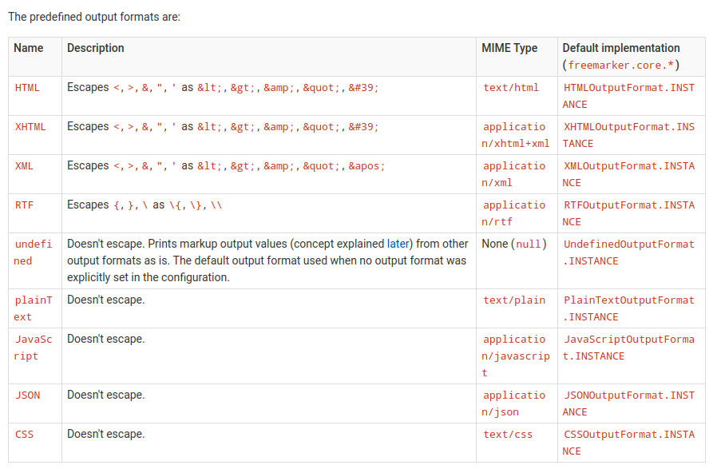

# 模板引擎的通用问题
- 使用模板引擎特别要紧的是如何处理字段或变量中的特殊字符，以避免这些特殊字符的直接输出造成的输出失效或数据注入，尤其是在处理多种形式的内容并存的模板时更需要特别注意，如HTML中inline的JS内容。

# 模板引擎的转义机制
## 自动转义与提示(HTML,XML)
### 自动转义
- 文档级 <#ftl autoesc=false>
- 块级 <#autoesc>xxxxx</#autoesc>  <#noautoesc>xxxxx</#noautoesc>
- 行级 ?esc ?no_esc
### 转义提示
- 文档级 By filename(ftlh for html, ftlx for xml) or <#ftl output_format="XML">
- 块级 <#outputformat "HTML">xxxxxx</#outputformat>
## 手动转义-无法自动转义(JS, JSON)
- ?js_string
- ?json_string

# Core Classes
- freemarker.core.HTMLOutputFormat
- freemarker.core.JSONOutputFormat

# Output Formats

# Test html&js Injection
- http://localhost:8080/html?htmlP="hello %26world'&jsP=abc";alert("<0>");" 

# Test json Injection
- http://localhost:8080/json?jsonP=123","ddd": "123"